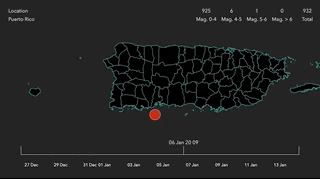

# D3 Puerto Rico Earthquakes

https://github.com/stephan227/d3-puerto-rico-earthquakes.git

This repo contains an html page with a visualization of earthquakes that occurred from December 26, 2019 to January 14, 2020.

The vizualization is made using D3.js

## Repo

## Demo

https://hopeful-wescoff-13c5b1.netlify.com/

## Development
1) Open ./index.html in a web editor
2) Open ./index.html using any web browser
 